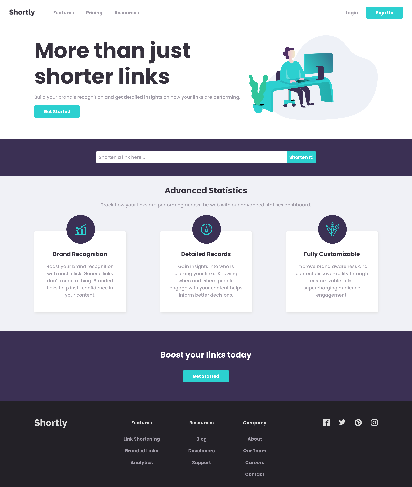

# Figma Design Tokens Demo

This is based on Frontend Mentor challenges.<br>
The goal of this project is to demonstrate the use of [Figma Design Tokens Plugin](https://github.com/vinicius-pretto/figma-design-tokens-plugin).



## Requirements

- Node.js >= v10.22
- NPM >= v6.14.6

## Running Application

**1. Install dependencies**

```
$ npm install
```

**2. Start**

```
$ npm start
```
